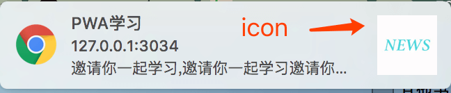
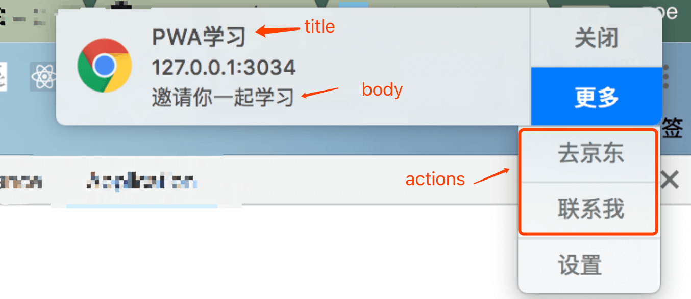

# 6.2.1 提醒界面

丰富的提醒界面可以是这样的：


显示提醒界面的接口在5.1.3节中已经使用过：`showNotification(title,options)`，第一个参数`title`很明显是消息界面的标题，第二个参数`options`是消息界面其他相关的配置，例如：

```javascript
 var options = {
    body : '邀请你一起学习，邀请你一起学习邀请你一起学习',     
    icon : '/img/icon_128.png', 
    actions : [{
        action : 'show-jd',
        title : '去京东'
    },{
        action : 'contact-me',
        title : '联系我'
    }],
    tag : 'pwa-starter',
    renotify : true
};
```

`title`、`options`配置对应的消息界面如下：





`title`：标题，不限制字数，当文字过多以省略号显示<br/>
`body`：简介，不限制字数，当文字过多以省略号显示<br/>
`icon` ： 图片，未规定图片尺寸大小<br/>
`actions` ： 新的按钮操作<br/>
    -`action` ：按钮的动作函数<br/>
    -`title` ：按钮的标题<br/>
`tag` ： 消息界面唯一的标志<br/>
`renotify` ： 表示是否重复多次显示消息界面，当设为`false`，出现过一次的`tag`消息，将不会再出现

将配置加入`serviceWorker.js`的`push`事件中：

```javascript
//serviceWorker.js

self.addEventListener('push' , function(e){
    var data = e.data;
    if(e.data){
        data = data.json();
        console.log('push的数据为：',data);
        var title = data;
        var options = {
            body : '邀请你一起学习',
            icon : '/img/icon_128.png',
            actions : [{
                action : 'show-jd',
                title : '去京东'
            },{
                action : 'contact-me',
                title : '联系我'
            }],
            tag : 'pwa-starter',
            renotify : true
        };
        self.registration.showNotification(title,options);
    }else{
        console.log('push没有任何数据')
    }
})
```

也可以在`index.js`中通过点击某个按钮直接显示消息提醒，配置相同：

```
//index.js
...
 document.querySelector('.J_notification').addEventListener('click',function(e){
    var title = 'PWA学习';
    var options = {
        ...
    };
    registration.showNotification(title,options)
})
...
```