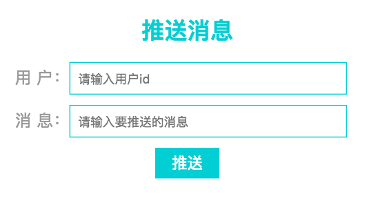
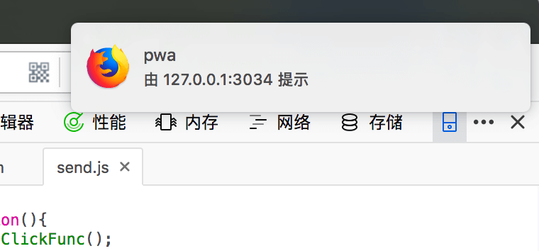

# 6.1.4 Service Worker接收消息

服务器推送消息至push service，push service再推送消息给用户，因此服务器发送的消息先是被Service Worker的`push`事件捕获。

```javascript
//serviceWorker.js
self.addEventListener('push' , function(e){
    var data = e.data;
    if(data){
        self.registration.showNotification(data);
    }else{
        console.log('push没有任何数据')
    }
})
```

`self`指向的是`serviceWorker`，push service通过`self.registration.showNotification`方法向用户发送提醒。

这就是消息推送的三大流程，到这里就可以直接给用户推送消息。可以新建一个后台页面进行消息推送，也可以使用[postman](https://www.getpostman.com/)模拟后台推送消息。在demo中，我简单地搭了一个后台页面：



用户id指的是打开页面时生成的uniqueid，输入用户id和要传送的消息后，点击推送，就会收到推送消息。



由于chrome浏览器的`push service`是FCM，需要翻墙和配置[firbase](https://console.firebase.google.com/)才能使用。firfox浏览器使用的是自家的`push service`，不需要其他操作就可以收到消息推送。