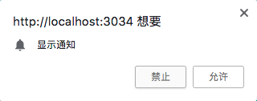

# 6.1.2 客户端订阅消息推送

消息推送的第一步是订阅，订阅又分为三部分：

（1）向用户请求消息推送
（2）向push service发送订阅消息
（3）将PushSubscription发送至服务器


</br>

**（1）向用户请求消息推送：**

通过向用户弹出推送请求弹窗向用户请求：



实现方法通过`Notification.requestPermission()`:

```javascript
//index.js
function askPermission(){
    return new Promise(function(resolve , reject){
        var permissionResult = Notification.requestPermission(function(result){
            //旧版本
            resolve(result);
        })
        if(permissionResult){
            //新版本
            permissionResult.then(resolve , reject);
        }
    }).then(function(permissionResult){
        if(permissionResult !== 'granted'){
            throw new Error('We weren\'t granted permission.');
        }
    })
}
```

新的语法会返回一个promise处理请求结果，旧版本则通过回调函数处理，因此需要同时处理这两种情况。

`permissionResult`返回结果有三种，`granted`、`denied`、`default`，`granted`为允许，`denied`为禁止，`default`为默认浏览器处理结果。

在注册Service Worker成功后进行推送的请求：

```javascript
//index.js 
//在使用之前还需判断是否支持PushManager
if('serviceWorker' in navigator && 'PushManager' in window){
    navigator.serviceWorker.register('./serviceWorker.js').then(function(registration){
        return Promise.all([
            registration,
            askPermission()
        ])
    }).then(function(result){
        ...
    })
}
```

加上上面的代码之后，刷新页面就会出现推送请求的弹窗：


当用户点击之后，无论用户选择什么，浏览器后记住用户的操作，再次访问时，不会再弹出该窗口，即该窗口指出现一次。

</br>

**（2）向push service发送订阅消息**

应用服务钥匙有一个公钥和一个私钥，私钥用于服务器，公钥用于push service。在订阅消息时，需要将公钥发送给push service。push service创建`endpoint`传递给浏览器，浏览器将`endpoint`加到`PushScription`，通过`subsribe()`的`promise`返回，这就是发送订阅消息的过程。


**push service**的功能是接收请求，验证并发送消息至指定的页面，操控消息的接收和推送。甚至在页面断网时，将会继续等待直到浏览器联网时推送消息。push service存在浏览器中，每个浏览器都会使用不同的push service，庆幸的是，push service遵循[Web Push Protocal](https://tools.ietf.org/html/draft-ietf-webpush-protocol-12)，使用相同的API，就可以在不同的push service通用。

**PushSubscription**可作为一个用户的id信息，包含了订阅的所有信息，例如：


上图中的`endpoint`中可以得出该浏览器使用的push service是`fcm.googleapis.com`，`eq2HeeL0Mcs...`是指向的用户。

公钥和私钥的创建可以通过`web-push`：

```
npm install -g web-push
web-push generate-vapid-keys
```

向push service发送订阅信息通过`registration.pushManager.subscribe()`发送，需要向`subscribe()`传入一个对象，该对象中包含`userVisibleOnly`和`applicationServerKey`。

**userVisibleOnly**：boolean值，标志消息的推送通过发送消息提醒用户，还是在后台默默的发送不提醒用户。部分浏览器只支持`userVisibleOnly`为`true`，如果设置为`false`或不设置，浏览器报错。


**applicationServerKey**：客户端的公钥，要求Unit8Array类型。

```javascript
//index.js 
function subscribeUserToPush(registration , publicKey){
    var subscribeOptions = {
        userVisibleOnly : true,
        applicationServerKey : window.urlBase64ToUint8Array(publicKey)
    };
    return registration.pushManager.subscribe(subscribeOptions).then(function(pushSubscription){
        console.log('pushscription' ,pushSubscription)
        return pushSubscription;
    })
}
```
`applicationServerKey`要求参数是Unit8Array类型，而创建的公钥是base64类型，因此使用`urlBase64ToUint8Array`方法将base64转为Unit8Array。`urlBase64ToUint8Array`方法来自[base64util.js](https://github.com/alienzhou/learning-pwa/blob/push/public/base64util.js)。

在请求推送消息用户允许后发送订阅信息：

```javascript
//index.js
if('serviceWorker' in navigator && 'PushManager' in window){
    //公钥
    var publicKey = 'BBP3Ni05GCu_RTb7rAkOqfFPiDQkNhcAfOAhqxpaxmuKLhF3DYTldbl3vrmfTfHSHhCBXPgKhQXexEmDLLqV1sQ';
    
    navigator.serviceWorker.register('./serviceWorker.js').then(function(registration){
        return Promise.all([
            registration,
            askPermission()
        ])
    }).then(function(result){
        var registration = result[0];

        return subscribeUserToPush(registration,publicKey)
    })
```

</br>

**（3）将PushSubscription发送至服务器**

拿到`PushSubscription`后，将`PushSubscription`发送到后台服务器，后台服务器将会存储该用户的信息，并通过`PushSubscription`来推送信息。

假设服务器端用Nodejs已经实现接收并存储`PushSubscription`的接口`/subscription`，具体实现可查看[源码](https://github.com/ZENGzoe/pwa-exercise/blob/master/app.js)。

```javascript
//index.js
//将PushSubscription发送至服务器
function sendSubscriptionToServer(body){
    var url = '/subscription';
    return new Promise(function(resolve , reject){
        var xhr = new XMLHttpRequest();
        xhr.timeout = 7000;
        xhr.onreadystatechange = function(){
            var response = {};
            if(xhr.readyState == 4 && xhr.status == 200){
                try{
                    response = JSON.parse(xhr.responseText);
                }catch(e){
                    response = xhr.responseText
                }
                resolve(response)
            }else if(xhr.readyState == 4){
                resolve();
            }
        }
        xhr.onabort = reject;
        xhr.onerror = reject;
        xhr.ontimeout = reject;
        xhr.open('POST' , url , true);
        xhr.setRequestHeader('Content-Type' , 'application/json');
        xhr.send(body)
    })
}

```

在获得`subscription`后发送至服务器：

```
if('serviceWorker' in navigator && 'PushManager' in window){
    ...

    navigator.serviceWorker.register('./serviceWorker.js').then(function(registration){
        ...
    }).then(function(result){
        ...
    }).then(function(subscription){
        var body = {subscription : subscription};

        body.uniqueid = new Date().getTime();   //为方便服务器推送消息至指定的客户端
        console.log('uniqueid' , body.uniqueid);

        return sendSubscriptionToServer(JSON.stringify(body));
    }).then(function(res){
        console.log(res)
    }).catch(function(e){
        console.log(e)
    })
```

给每个打开的页面都设定唯一的`uniqueid`，方便服务器对特定的客户端推送消息。