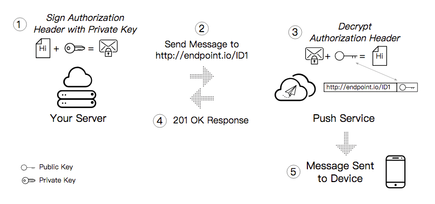

# 6.1.3 服务器端推送消息给浏览器

服务器端发送消息给浏览器需要保证信息的安全性，那么这就需要公钥私钥来保证信息的安全性。上文也提到私钥用户服务器，公钥用于push service,那么公钥私钥的使用逻辑如下：



（1）服务器用私钥对验证头签名<br/>
（2）服务器将用私钥签名了的消息发送至对应的push service<br/>
（3）push service收到消息后，用公钥验证解密<br/>
（4）push service确认验证通过无误，告诉服务器验证通过<br/>
（5）push service将消息发送至正确的客户端

由于消息推送的流程过于复杂，较难定位出现的问题，因此推荐使用[web push](https://github.com/web-push-libs/web-push)这个库进行消息加密、格式化和触发Service Worker的`push`事件。

```javascript
//app.js
var webpush = require('web-push');
```

由于服务器需要使用私钥，因此需要在`web-push`设置应用服务钥匙：

```javascript
//app.js

//先前生成的公钥和私钥
var vapidKeys = {
    privateKey:"9mHKxhF60T4iApR4f4dDKtdXL8PK5dj3TfDBAK8iufI",
    publicKey:"BBP3Ni05GCu_RTb7rAkOqfFPiDQkNhcAfOAhqxpaxmuKLhF3DYTldbl3vrmfTfHSHhCBXPgKhQXexEmDLLqV1sQ"
}

webpush.setVapidDetails(
    'mailto:563282341@qq.com',
    vapidKeys.publicKey,
    vapidKeys.privateKey
)
```
`web push`要求传入发送者的邮箱，为了能够方便地联系到发送者传递有用的信息。

在服务器端，我们使用`/push`路由，向客户端发送消息推送：

```nodejs
router.post('/push' , koaBody() , async ctx => {
    let { uniqueid , payload } = ctx.request.body;
    let list = uniqueid ? await util.find({uniqueid}) : await util.findAll();   //查找指定的用户
    let status = list.length > 0 ? 0 : -1;

    for(let i = 0 ; i < list.length ; i++){
        let subscription = list[i].subscription;
        pushMessage(subscription , JSON.stringify(payload));
    }

    ctx.response.body = {
        status
    }
})
```
在demo中，使用了`nedb`数据库存储用户的`pushSubscription`，详细实现代码可以查看[源码](https://github.com/ZENGzoe/pwa-exercise/blob/master/util.js)

在`pushMessage`方法中使用了`web-push`的`sendNotification`方法推送消息：

```javascript
//app.js
function pushMessage(subscription , data = {}){
    webpush.sendNotification(subscription , data , options).then(data => {
        console.log('push service的相应数据' , JSON.stringify(data));
        return;
    }).catch(err => {
        //410和404表示subscription过期不再有效
        if(err.statusCode === 410 || err.statusCode === 404){
            console.log(err);
            return util.remove(subscription)
        }else{
            console.log(subscription);
            console.log(err);
        }
    })
}
```

`webpush.sendNotification`推送消息的事件能被客户端的`push`事件捕获。