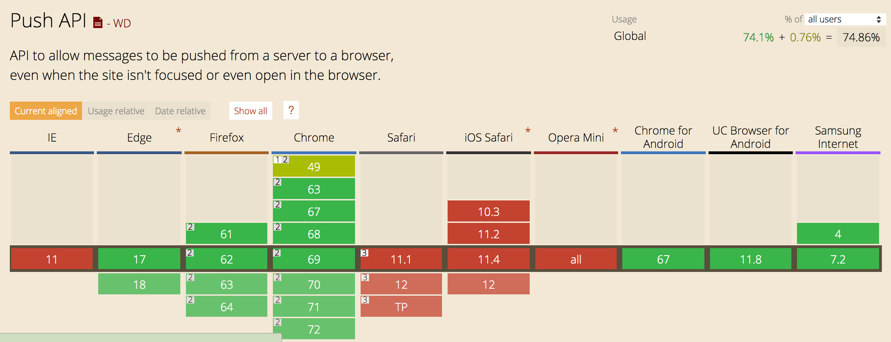
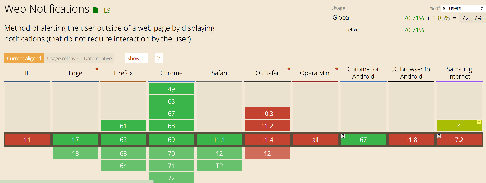

# 6.3. 兼容性

在caniuse查看[Push API](https://caniuse.com/#search=push)和[Notification API](https://caniuse.com/#search=notification)的兼容性：

1.`Push API`在ios safari不兼容，在Android和pc端兼容性较好。如果浏览器使用的是FCM的`push service`在国内不能使用。

2.`Notification API`在移动端兼容性较差，在pc端得到比较好的支持。其中`actions`目前只在Chrome浏览器支持。