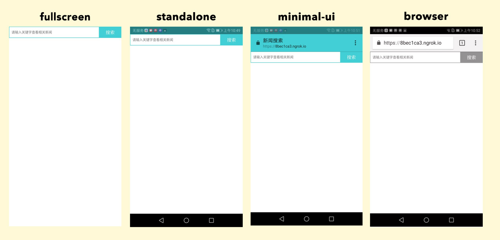

# 4.1. 配置manifest.json

以下为manifest.json例子：

```json
{
    "name" : "新闻搜索",
    "short_name" : "news",
    "start_url" : "/",
    "display" : "standalone",       
    "background_color" : "#02cfd4",
    "description" : "可以用于新闻搜索的小应用",
    "theme_color" : "#02cfd4",
    "orientation" : "portrait-primary",
    "icons" : [
        {
            "src" : "img/icon_32.png",
            "sizes" : "32x32",
            "type" : "image/png"
        },{
            "src" : "img/icon_72.png",
            "sizes" : "72x72",
            "type" : "image/png"
        },{
            "src" : "img/icon_128.png",
            "sizes" : "128x128",
            "type" : "image/png"
        },{
            "src" : "img/icon_144.png",
            "sizes" : "144x144",
            "type" : "image/png"
        },{
            "src" : "img/icon_192.png",
            "sizes" : "192x192",
            "type" : "image/png"
        },{
            "src" : "img/icon_256.png",
            "sizes" : "256x256",
            "type" : "image/png"
        },{
            "src" : "img/icon_512.png",
            "sizes" : "512x512",
            "type" : "image/png"
        }
    ] 
}
```

配置解释：

`name` : 打开桌面web应用时，启动页的标题<br/>
`short_name` : 添加至桌面应用的名称<br/>
`start_url` : 桌面应用打开的地址，如设置为'/'，为manifest.json当前路径的index.html<br/>
`display` : 桌面应用打开后展示的模式，有四种模式：fullscreen、standalone、minimal-ui、browser<br/>
    -`fullscreen`模式 : 页面占满整个屏幕<br/>
    -`standalone`模式 : 此模式比较相似在app打开，与全屏模式相比，展示手机屏幕顶部信息时间、电量等信息栏。<br/>
    -`minimal-ui`模式 : 与standalone模式相比，多出浏览器地址栏<br/>
    -`browser`模式 : 浏览器模式，与浏览器打开一致



其中，部分Android手机Chrome浏览器能够兼容四种模式，部分Android手机Chrome浏览器目前只兼容standalone和browser模式，fullscreen和minimal-ui则向下兼容为standalone和browser模式。

`background_color` : 启动页背景颜色<br/>
`description` : web应用描述<br/>
`theme_color` : 打开桌面应用，地址栏、信息栏主题颜色,可看上图的standalone和minimal-ui模式<br/>
`orientation` : 指定页面的展示方向，会根据不同设备横竖屏的角度去定义。<br/>
    -`portrait`｜`portrait-primary`｜`portrait-secondary` : 竖屏<br/>
    -`portrait`｜`portrait-primary`｜`portrait-seconday` : 横屏<br/>
    -`natural` :  设备屏幕旋转角度为0° 对应的方向<br/>
    -`any` : 可根据设备屏幕角度旋转页面<br/>
`icons` : 桌面应用icon图、开启页展示图，数组格式，浏览器会选择适合的尺寸作为icon图<br/>
    -`src` : icon地址<br/>
    -`sizes` : icon尺寸，单位为px，格式为宽x高<br/>
    -`type` : icon格式，如png为image/png、jpg为image/jpg、jpeg为image/jpeg

