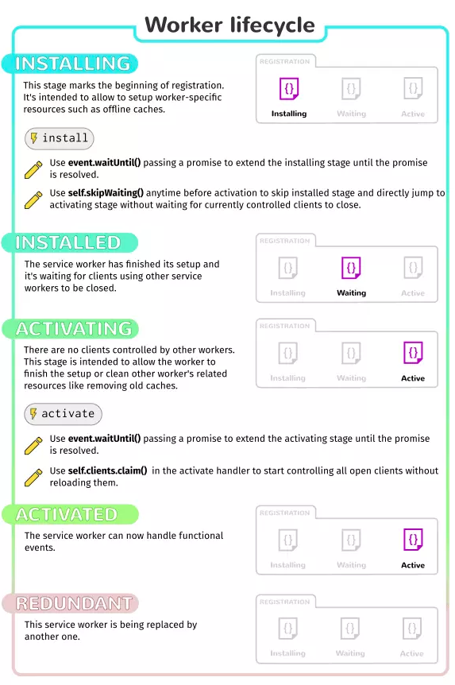

# 5.1. Service Worker介绍

Service Worker：服务工作线程，是浏览器在后台独立于网页运行的脚本。因此Service Worker的运行不会阻塞js脚本的运行。除了可以实现离线缓存，Service Worker在消息推送、后台同步等功能中都扮演着重要的角色，详细的api将会随着余下章节介绍。

使用Service Worker，可以拦截请求，具有一定的安全性问题，因此项目部署发布时，Service Worker只能HTTPS域下内使用。为了方便开发调试，规定还可在`localhost`或`127.0.0.1`下使用。

Service Worker有自己的生命周期，当在Javascript注册Service Worker后，Service Worker的生命周期开始。

Service Worker生命周期：installing（安装中） -> installed（安装后） -> activating（激活中） -> activated（激活后） -> redunbant（无用）。

**installing阶段：** 通常用来缓存资源。

`event.waitUntil()` : 参数为一个promise，在该promise中进行资源的缓存，缓存资源成功则安装成功，缓存资源失败则安装失败。

`self.skipWaiting()` : 可跳过安装等待阶段，直接进入激活阶段，加快工作进程。

**installed阶段：** 表示Service Worker安装成功。

**activating阶段：** 通常用来清除旧缓存。

`event.waitUntil()` : 参数为一个promise，在该promise中清除旧缓存。

`self.client.claim()` : 控制未受控制的客户端。默认情况下，安装Service Worker之后，需要刷新页面才能有Service Worker系列操作，执行该方法，可改变该默认情况，无需重新刷新页面。

**activated阶段：** 表示Service Worker可以控制客户端。

**redunbant阶段：** 无用阶段。当Service Worker install失败、activate失败或有新的Service Worker代替，则Service Worker变为redunbant。

